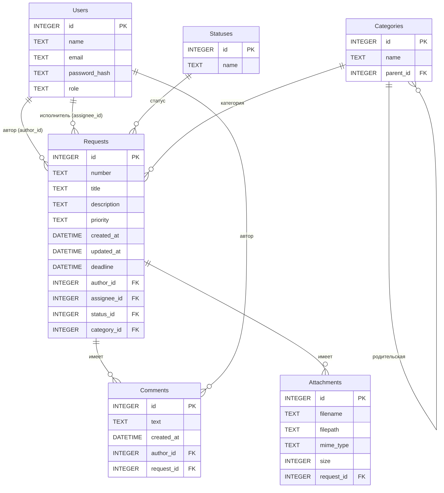

```mermaid
erDiagram
    Users {
        INTEGER id PK
        TEXT name
        TEXT email
        TEXT password_hash
        TEXT role
    }
    Statuses {
        INTEGER id PK
        TEXT name
    }
    Categories {
        INTEGER id PK
        TEXT name
        INTEGER parent_id FK
    }
    Requests {
        INTEGER id PK
        TEXT number
        TEXT title
        TEXT description
        TEXT priority
        DATETIME created_at
        DATETIME updated_at
        DATETIME deadline
        INTEGER author_id FK
        INTEGER assignee_id FK
        INTEGER status_id FK
        INTEGER category_id FK
    }
    Comments {
        INTEGER id PK
        TEXT text
        DATETIME created_at
        INTEGER author_id FK
        INTEGER request_id FK
    }
    Attachments {
        INTEGER id PK
        TEXT filename
        TEXT filepath
        TEXT mime_type
        INTEGER size
        INTEGER request_id FK
    }

    Users ||--o{ Requests : "автор (author_id)"
    Users ||--o{ Requests : "исполнитель (assignee_id)"
    Statuses ||--o{ Requests : "статус"
    Categories ||--o{ Requests : "категория"
    Requests ||--o{ Comments : "имеет"
    Users ||--o{ Comments : "автор"
    Requests ||--o{ Attachments : "имеет"
    Categories ||--o{ Categories : "родительская"
```